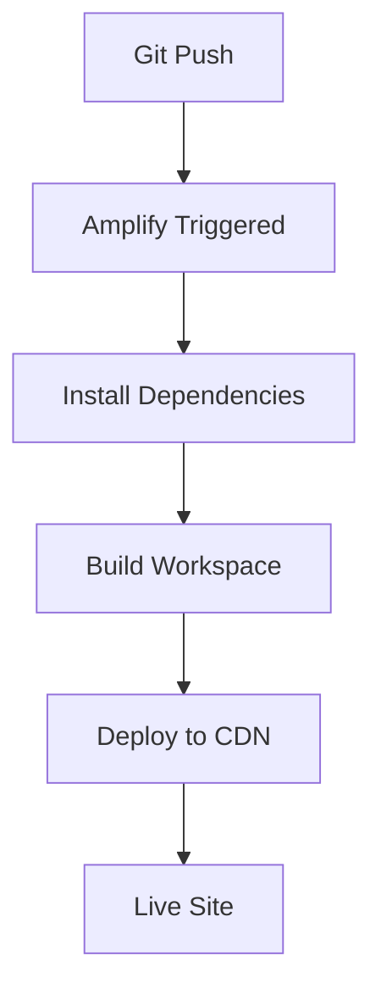

# AWS Amplify Deployment Guide

## 🚀 **AWS Amplify Configuration for NPM Workspace Structure**

This guide explains how to deploy your Next.js app with NPM workspace structure to AWS Amplify.

## 📋 **Project Structure**

```text
modus-next-app/                    # Root workspace
├── amplify.yml                   # Amplify build configuration
├── package.json                   # Workspace configuration
├── packages/
│   ├── app/                      # Main Next.js app (deployment target)
│   │   ├── package.json          # App dependencies
│   │   ├── next.config.ts        # Next.js configuration
│   │   └── app/                  # Next.js App Router
│   └── demos/                    # Optional demos workspace
```

## 🔧 **AWS Amplify Console Settings**

### **Build Settings Configuration:**

1. **Connect Repository**: Connect your GitHub repository
2. **Build Settings**: Use the `amplify.yml` file (already created)
3. **Environment Variables**: Add these in Amplify Console:

```bash
# Required Environment Variables
NODE_VERSION=20
NPM_CONFIG_PREFIX=/usr/local
NEXT_TELEMETRY_DISABLED=1
NODE_ENV=production
```

### **Advanced Build Settings:**

- **Root Directory**: Leave empty (uses root)
- **Build Command**: `npm run build --workspace=modus-next-app`
- **Start Command**: `npm run start --workspace=modus-next-app`

## 📁 **amplify.yml Configuration**

The `amplify.yml` file is already configured with:

✅ **Workspace Support**: Handles NPM workspace structure  
✅ **Turbopack Optimization**: Uses Next.js 15 Turbopack for faster builds  
✅ **Caching Strategy**: Optimized caching for workspace dependencies  
✅ **Build Verification**: Validates build output and structure  
✅ **Environment Variables**: Production-ready environment setup

## 🎯 **Deployment Steps**

### **1. Pre-Deployment Checklist**

- [ ] ✅ All dependencies are in `packages/app/package.json`
- [ ] ✅ Build works locally: `npm run build --workspace=modus-next-app`
- [ ] ✅ No linting errors: `npm run lint:colors && npm run lint:icons`
- [ ] ✅ TypeScript compilation passes: `npm run type-check`

### **2. AWS Amplify Setup**

1. **Connect Repository**:

   - Go to AWS Amplify Console
   - Click "New app" → "Host web app"
   - Connect your GitHub repository
   - Select the main branch

2. **Configure Build Settings**:

   - Amplify will auto-detect the `amplify.yml` file
   - Review the build settings (should be pre-configured)
   - Add environment variables listed above

3. **Deploy**:
   - Click "Save and deploy"
   - Monitor the build logs for any issues

### **3. Build Process Flow**



## 🔍 **Troubleshooting**

### **Common Issues & Solutions**

#### **Issue: Build Fails with Workspace Dependencies**

```bash
# Solution: Ensure all dependencies are in packages/app/package.json
cd packages/app
npm install --save [missing-dependency]
```

#### **Issue: "Cannot find module" Errors**

```bash
# Solution: Verify workspace structure
npm list --workspace=modus-next-app
```

#### **Issue: Build Output Not Found**

```bash
# Solution: Check build directory
ls -la packages/app/.next/
```

### **Build Log Analysis**

Look for these success indicators in Amplify build logs:

```bash
✅ "Building Next.js app from packages/app"
✅ "Build completed successfully"
✅ "Checking build artifacts..."
```

## 🚀 **Performance Optimizations**

### **Caching Strategy**

- **Node Modules**: Cached for faster subsequent builds
- **Next.js Cache**: Turbopack cache preserved
- **NPM Cache**: Package manager cache optimized

### **Build Optimizations**

- **Turbopack**: Faster builds with Next.js 15
- **Workspace Dependencies**: Only installs what's needed
- **Environment Variables**: Production-optimized settings

## 📊 **Monitoring & Maintenance**

### **Build Metrics to Monitor**

- Build time (should be < 5 minutes)
- Bundle size (check for unexpected increases)
- Cache hit rate (should improve over time)

### **Regular Maintenance**

- Update dependencies regularly
- Monitor build logs for warnings
- Test deployments in staging first

## 🔄 **Alternative Deployment Options**

If you encounter issues with the workspace structure:

### **Option 1: Simplified Structure**

Move the main app to root and deploy traditionally:

```bash
# Move app to root
mv packages/app/* .
mv packages/app/.* . 2>/dev/null || true
rm -rf packages/
```

### **Option 2: Separate Repository**

Create a separate repository for the main app:

```bash
# Create new repo with just the app
git subtree push --prefix=packages/app origin main
```

## ✅ **Success Criteria**

Your deployment is successful when:

- [ ] ✅ Build completes without errors
- [ ] ✅ Site loads at the Amplify URL
- [ ] ✅ All Modus components render correctly
- [ ] ✅ Theme switching works
- [ ] ✅ All interactive elements function
- [ ] ✅ Responsive design works on mobile/desktop

## 📚 **Additional Resources**

- [AWS Amplify Next.js Documentation](https://docs.aws.amazon.com/amplify/latest/userguide/deploy-nextjs-app.html)
- [Next.js Deployment Guide](https://nextjs.org/docs/deployment)
- [NPM Workspaces Documentation](https://docs.npmjs.com/cli/v7/using-npm/workspaces)

---

**Last Updated**: 2025-01-15  
**Configuration Version**: 1.0  
**Compatible With**: Next.js 15, React 19, AWS Amplify
