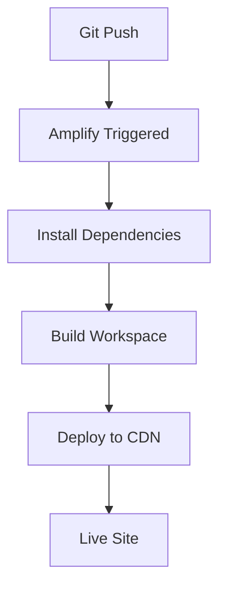

# AWS Amplify Deployment Guide

## 🚀 **AWS Amplify Configuration for NPM Workspace Structure**

This guide explains how to deploy your Next.js app with NPM workspace structure to AWS Amplify.

## ⚠️ **CRITICAL: Avoid Common Deployment Issues**

### 🚨 **DO NOT Use amplify.yml for NPM Workspaces**

**❌ WRONG APPROACH:**

- Creating complex `amplify.yml` files with `applications` key
- Trying to configure monorepo settings in YAML

**✅ CORRECT APPROACH:**

- Use AWS Amplify UI settings for monorepo configuration
- Let Amplify auto-detect Next.js framework
- Use environment variables for monorepo root

### 🎯 **Key Success Factors**

1. **Use UI Settings, Not YAML** - Configure monorepo in Amplify Console
2. **Correct Build Command** - `npm run build --workspace=modus-next-app` (NOT `--workspace=packages/app`)
3. **Environment Variables** - Set `AMPLIFY_MONOREPO_APP_ROOT=packages/app`
4. **No amplify.yml File** - Let Amplify auto-detect everything

## 📋 **Project Structure**

```text
modus-next-app/                    # Root workspace
├── node_modules/                  # Hoisted dependencies (ALL here)
├── package.json                   # Workspace configuration
├── packages/
│   ├── app/                      # Main Next.js app (deployment target)
│   │   ├── .next/                # Build output (generated)
│   │   ├── package.json          # App dependencies
│   │   ├── next.config.ts        # Next.js configuration
│   │   └── app/                  # Next.js App Router
│   └── demos/                    # Optional demos workspace
│       ├── .next/                # Build output (generated)
│       └── package.json          # Demos dependencies
```

## 🔧 **AWS Amplify Console Settings (UI Configuration)**

### **Step 1: Connect Repository**

1. **Go to AWS Amplify Console**
2. **Click "New app" → "Host web app"**
3. **Connect your GitHub repository**
4. **Select your main branch**

### **Step 2: Configure Monorepo Settings**

**✅ CRITICAL: Use UI Settings, NOT amplify.yml**

1. **Check "My app is a monorepo"**
2. **Set Monorepo root directory**: `packages/app`
3. **Let Amplify auto-detect** the framework (Next.js)

### **Step 3: Verify Build Settings**

**✅ Auto-Detected Settings Should Be:**

- **Framework**: Next.js (auto-detected)
- **Frontend build command**: `npm run build --workspace=modus-next-app`
- **Build output directory**: `packages/app/.next`

**❌ If build command shows `--workspace=packages/app`, change it to `--workspace=modus-next-app`**

### **Step 4: Environment Variables**

**✅ Required Environment Variables:**

```bash
AMPLIFY_MONOREPO_APP_ROOT=packages/app
AMPLIFY_DIFF_DEPLOY=false
```

**❌ DO NOT add these (not needed):**

- `NODE_VERSION` (auto-detected)
- `NPM_CONFIG_PREFIX` (not needed)
- `NEXT_TELEMETRY_DISABLED` (optional)
- `NODE_ENV` (auto-set to production)

## 🎯 **Deployment Steps**

### **1. Pre-Deployment Checklist**

- [ ] ✅ All dependencies are in `packages/app/package.json`
- [ ] ✅ Build works locally: `npm run build --workspace=modus-next-app`
- [ ] ✅ No linting errors: `npm run lint:colors && npm run lint:icons`
- [ ] ✅ TypeScript compilation passes: `npm run type-check`
- [ ] ✅ **NO amplify.yml file** (delete if exists)

### **2. AWS Amplify Setup**

1. **Connect Repository**:

   - Go to AWS Amplify Console
   - Click "New app" → "Host web app"
   - Connect your GitHub repository
   - Select your main branch

2. **Configure Monorepo Settings**:

   - ✅ Check "My app is a monorepo"
   - ✅ Set Monorepo root directory: `packages/app`
   - ✅ Let Amplify auto-detect Next.js framework

3. **Verify Build Settings**:

   - ✅ Framework: Next.js (auto-detected)
   - ✅ Build command: `npm run build --workspace=modus-next-app`
   - ✅ Build output: `packages/app/.next`

4. **Set Environment Variables**:

   - ✅ `AMPLIFY_MONOREPO_APP_ROOT=packages/app`
   - ✅ `AMPLIFY_DIFF_DEPLOY=false`

5. **Deploy**:
   - Click "Save and deploy"
   - Monitor the build logs for any issues

### **3. Build Process Flow**



## 🔍 **Troubleshooting**

### **🚨 CRITICAL: Common Issues & Solutions**

#### **Issue: "Monorepo spec provided without 'applications' key" Error**

**❌ CAUSE:** Using `amplify.yml` with monorepo UI settings
**✅ SOLUTION:** Delete `amplify.yml` file and use UI settings only

```bash
# Delete amplify.yml file
rm amplify.yml
git add -A && git commit -m "Remove amplify.yml to use UI monorepo settings" && git push
```

#### **Issue: Build Command Shows `--workspace=packages/app`**

**❌ WRONG:** `npm run build --workspace=packages/app`
**✅ CORRECT:** `npm run build --workspace=modus-next-app`

**Solution:** Edit build command in Amplify Console to use workspace name, not path.

#### **Issue: Build Fails with Workspace Dependencies**

```bash
# Solution: Ensure all dependencies are in packages/app/package.json
cd packages/app
npm install --save [missing-dependency]
```

#### **Issue: "Cannot find module" Errors**

```bash
# Solution: Verify workspace structure
npm list --workspace=modus-next-app
```

#### **Issue: Build Output Not Found**

```bash
# Solution: Check build directory
ls -la packages/app/.next/
```

### **Build Log Analysis**

Look for these success indicators in Amplify build logs:

```bash
✅ "Installing dependencies..."
✅ "Building Next.js app..."
✅ "Build completed successfully"
✅ "Deploying to CDN..."
```

### **❌ What NOT to Do**

1. **Don't create amplify.yml** for NPM workspaces
2. **Don't use `applications` key** in YAML
3. **Don't set build command to `--workspace=packages/app`**
4. **Don't add unnecessary environment variables**

## 🚀 **Performance Optimizations**

### **Caching Strategy**

- **Node Modules**: Cached for faster subsequent builds
- **Next.js Cache**: Turbopack cache preserved
- **NPM Cache**: Package manager cache optimized

### **Build Optimizations**

- **Turbopack**: Faster builds with Next.js 15
- **Workspace Dependencies**: Only installs what's needed
- **Environment Variables**: Production-optimized settings

## 📊 **Monitoring & Maintenance**

### **Build Metrics to Monitor**

- Build time (should be < 5 minutes)
- Bundle size (check for unexpected increases)
- Cache hit rate (should improve over time)

### **Regular Maintenance**

- Update dependencies regularly
- Monitor build logs for warnings
- Test deployments in staging first

## 🔄 **Alternative Deployment Options**

If you encounter issues with the workspace structure:

### **Option 1: Simplified Structure (Last Resort)**

Move the main app to root and deploy traditionally:

```bash
# Move app to root
mv packages/app/* .
mv packages/app/.* . 2>/dev/null || true
rm -rf packages/
```

### **Option 2: Separate Repository**

Create a separate repository for the main app:

```bash
# Create new repo with just the app
git subtree push --prefix=packages/app origin main
```

### **Option 3: Fix Current Setup (Recommended)**

**Before trying alternatives, ensure you're following the correct approach:**

1. ✅ **Delete amplify.yml file**
2. ✅ **Use UI monorepo settings**
3. ✅ **Set correct build command**
4. ✅ **Use proper environment variables**

**This should work 99% of the time!**

## ✅ **Success Criteria**

Your deployment is successful when:

- [ ] ✅ Build completes without errors
- [ ] ✅ Site loads at the Amplify URL
- [ ] ✅ All Modus components render correctly
- [ ] ✅ Theme switching works
- [ ] ✅ All interactive elements function
- [ ] ✅ Responsive design works on mobile/desktop

## 📚 **Additional Resources**

- [AWS Amplify Next.js Documentation](https://docs.aws.amazon.com/amplify/latest/userguide/deploy-nextjs-app.html)
- [Next.js Deployment Guide](https://nextjs.org/docs/deployment)
- [NPM Workspaces Documentation](https://docs.npmjs.com/cli/v7/using-npm/workspaces)

## 📋 **Quick Reference Checklist**

### **✅ Before Deployment:**

- [ ] No `amplify.yml` file in repository
- [ ] Build works locally: `npm run build --workspace=modus-next-app`
- [ ] All dependencies in `packages/app/package.json`

### **✅ Amplify Console Settings:**

- [ ] Monorepo checked: "My app is a monorepo"
- [ ] Root directory: `packages/app`
- [ ] Build command: `npm run build --workspace=modus-next-app`
- [ ] Environment variables: `AMPLIFY_MONOREPO_APP_ROOT=packages/app`

### **✅ After Deployment:**

- [ ] Site loads at Amplify URL
- [ ] All Modus components render
- [ ] Theme switching works
- [ ] Responsive design works

---

**Last Updated**: 2025-01-15  
**Configuration Version**: 2.0  
**Compatible With**: Next.js 15, React 19, AWS Amplify  
**Key Lesson**: Use UI settings, not amplify.yml for NPM workspaces
